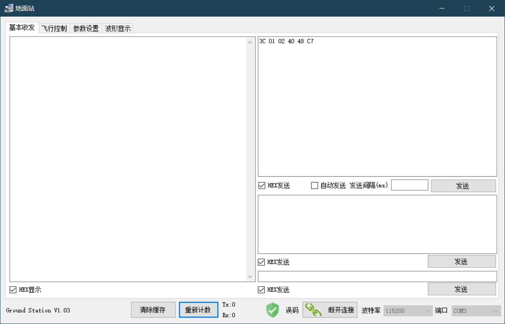
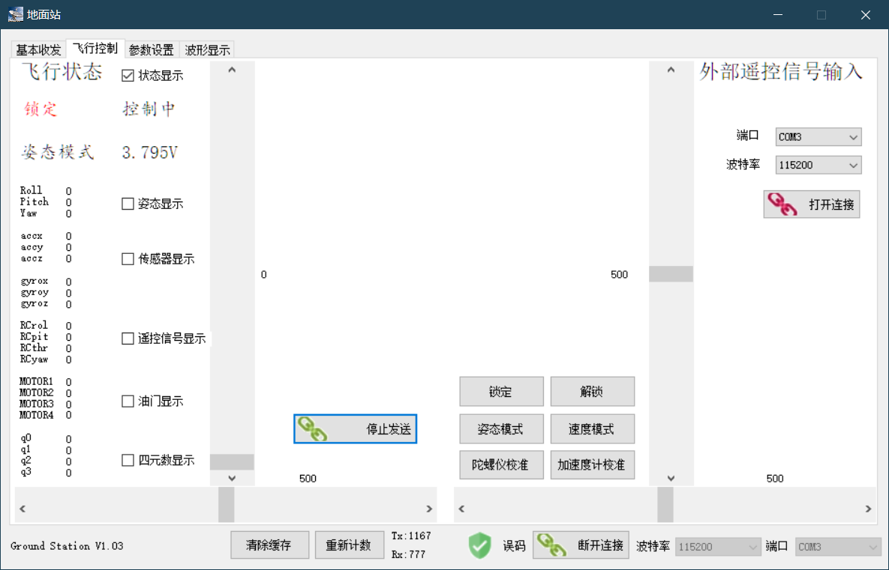
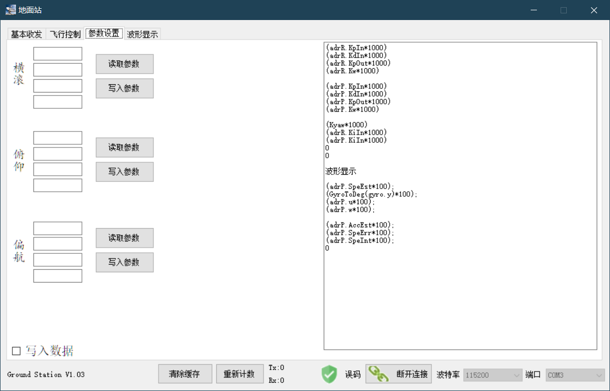
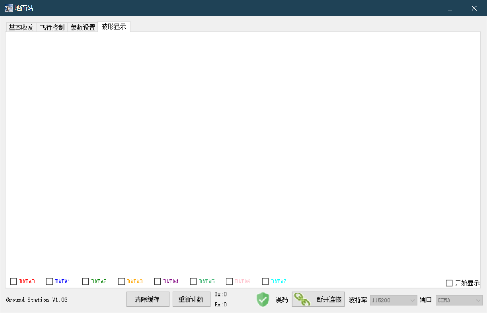

# 西电航协地面站PC端

## Status

    

## Overview

这是西电航协微型四轴飞行器ADRC版本飞控端的上位机源代码，该版本与PID版本串口通讯协议不同，因此不适用于PID版本的代码。

这是一个[Visual Studio 2019](https://visualstudio.microsoft.com/zh-hans/vs/) 工程，打开最新版Visual Studio 2019导入工程文件或双击sln工程文件即可打开该工程源码。

该项目已经基本完成，正在持续维护中。

修改代码的时候，请在master分支下面新建一个特性分支，在该特性分支下进行代码的修改然后通过该分支执行pull request操作。确认无误后再合并至主分支。

bug相关和建议请移步至issue栏目

# 使用说明

c#上位机

版本 v1.03

有基本收发、飞行控制、参数设置、波形显示4个标签。

可自动识别可用端口号。

部分内容关闭重启后不会丢失。

[飞行器控制示例](https://github.com/xd15zhn/drone)

### 基本收发

3个发送窗口独立。第一个支持定时发送。前两个为多行，第三个为单行。

3个发送窗口的内容在关闭重启后不会丢失。

### 飞行控制

飞机解锁流程:

打开主串口->打开外部输入串口(可选)->将油门通道拨到底->点击"开始发送“->点击"解锁“

发送切换模式指令时同步发送锁定指令。

有2种方法可以进行飞行控制。第一种是用键盘WSAD和IKJL进行飞行控制；
第二种是符合协议的外部串口输入，可使用处理器将遥控器接收机的PWM信号转换成串口数据通过'飞行控制'标签下的串口输入。
第二种方法优先于第一种。

### 参数设置

一般地，控制器参数传输值是参数真实值的1000倍(一般为0.几至几)，状态参数传输值是参数真实值的100倍(一般为几至几十)。

右边为文本框，可自由输入，关闭重启后不会丢失。

写入参数后建议重新读取以检查是否成功写入。

左下角写入文件用于接收高速数据并直接将数据写入文件。

### 波形显示

注意右下角"开始显示"复选框。

更改选择显示的数据会清空并重新显示。

# 协议

协议说明:

SUM等于从该数据帧第一字节开始，也就是帧头开始，至该帧数据的最后一字节所有字节的和的最低位字节。

协议中长度字节表示该数据帧内包含数据的字节总长度，不包括帧头、功能字、长度字节和最后的校验位，只是数据的字节长度和。

3E、3C分别为">"、"<"的ASCII值。

### 飞控->地面站

|帧名称  |帧头|功能字|长度|数据  |校验|备注|
|-       |-   |-     |-   |-     |-   |-   |
|状态    |3E  |01    |03  |u8,u16|SUM |飞机状态(stat)/电压(乘1000取整)|
|姿态    |3E  |02    |06  |s16×3 |SUM |飞机姿态,roll/pitch/yaw数据各乘100|
|传感器  |3E  |04    |0C  |s16×6 |SUM |分别为陀螺仪和加速度计原始数据|
|遥控    |3E  |08    |08  |s16×4 |SUM |遥控器4个通道的控制信号|
|油门    |3E  |10    |08  |s16×4 |SUM |分别为4个电机的油门大小|
|四元数  |3E  |20    |08  |s16×4 |SUM |q0,q1,q2,q3各乘10000|
|ROL参数 |3E  |A1    |08  |s16×4 |SUM |ROL通道控制器参数×1000|
|PIT参数 |3E  |A2    |08  |s16×4 |SUM |PIT通道控制器参数×1000|
|YAW参数 |3E  |A3    |08  |s16×4 |SUM |YAW和THR通道控制器参数×1000|
|遥控命令|3E  |AA    |08  |s16×4 |SUM |遥控器4个通道的控制信号|
|波形1   |3E  |B1    |08  |s16×4 |SUM |波形显示通道1~4|
|波形2   |3E  |B2    |08  |s16×4 |SUM |波形显示通道5~8|
|系统辨识|40  |-     |-   |s16×2 |SUM |系统辨识所用输入与输出数据|

|-   |BIT7|BIT6|BIT5    |BIT4|BIT3|BIT2|BIT1|BIT0|
|-   |-   |-   |-       |-   |-   |-   |-   |-   |
|stat|异常|-   |速度模式|-   |-   |-   |-   |解锁|

示例: 3E 01 03 81 0F 00 D2 表示飞控发送状态数据,已侧翻,已解锁,电压3.840V。

注:功能字AA为外部遥控信号输入，来自于与其它数据帧不同的串口。

40数据帧用于发送高速高精度数据，没有功能和长度字节

### 地面站->飞控

|帧名称 |帧头|功能字|长度|数据 |校验|备注|
|-      |-   |-     |-   |-    |-   |-   |
|状态   |3C  |01    |01  |u8×1 |SUM |指令(stat)|
|遥控   |3C  |08    |08  |s16×4|SUM |发送遥控器4个通道的控制信号|
|ROL参数|3C  |A1    |08  |s16×8|SUM |写入ROL通道控制器参数×1000|
|PIT参数|3C  |A2    |08  |s16×8|SUM |写入PIT通道控制器参数×1000|
|YAW参数|3C  |A3    |08  |s16×8|SUM |写入YAW和THR通道控制器参数×1000|
|读参数1|3C  |C1    |01  |u8×1 |SUM |请求读取飞行参数(req1)|
|读参数2|3C  |C2    |01  |u8×1 |SUM |请求校准传感器与读取控制器参数(req2)|
|读参数3|3C  |C3    |01  |u8×1 |SUM |请求读取参数用于显示波形(req3)|
|读参数4|3C  |C4    |01  |u8×1 |SUM |请求读取系统辨识所用数据(reg4)|

|-   |BIT7      |BIT6    |BIT5  |BIT4 |BIT3 |BIT2  |BIT1 |BIT0 |
|-   |-         |-       |-     |-    |-    |-     |-    |-    |
|stat|速度      |姿态    |-     |-    |-    |-     |-    |解锁 |
|req1|-         |-       |四元数|油门 |遥控 |传感器|姿态 |状态 |
|req2|陀螺仪校准|加计校准|-     |-    |-    |Y参数 |P参数|R参数|
|req3|-         |-       |-     |-    |-    |-     |-    |-    |
|req4|-         |-       |-     |-    |-    |-     |位置1|位置0|

示例: 3C 01 01 41 7F 表示请求解锁并设置为姿态模式

注:stat的BIT7和BIT6为10时设置为速度模式,为01时设置为姿态模式,其它情况无效。

# 开发人员须知。

### 飞行控制

点击"开始发送"按钮开始以100ms间隔发送遥控帧。

### 参数设置

理论上，

### 版本更新

* 更改波形显示颜色。

* 更改高速接收数据帧协议(帧头40)。

* 添加误码显示。

# 其它注意事项

* 使用蓝牙串口时存在部分延迟卡顿等问题，因此强烈建议在断开串口或关闭地面站前先断开下位机电源。
